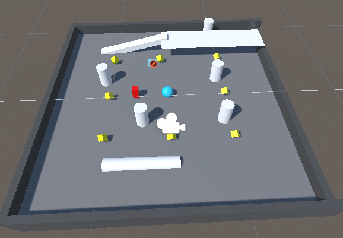
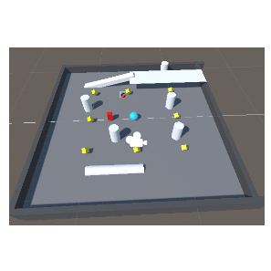

# Personalización del Tablero de Juego en Unity

Este proyecto es un juego de bolas utilizando Unity. Se ha diseñado un tablero de juego con más obstáculos y varios niveles. Además, se realizaron pruebas para asegurar la jugabilidad y una experiencia de usuario desafiante pero justa.

---

## Requisitos Completados

1. **Personalización del Tablero con Obstáculos:**
   - Se agregaron nuevos elementos de juego para aumentar la dificultad.
   - Los nuevos obstáculos incluyen:
     - Barreras móviles.
     - Rutas angostas y plataformas elevadas.

2. **Pruebas del Recorrido con la Bola:**
   - Se realizaron pruebas exhaustivas para asegurar que la bola pueda completar el recorrido.
3. **Diseño de Varios Niveles:**
   - **Nivel 1:** Introducción simple con pocos obstáculos para familiarizar al jugador con los controles.
   - **Nivel 2:** Mayor cantidad de obstáculos y caminos más estrechos.
   - **Nivel 3:** Combinación de plataformas móviles y zonas que requieren mayor precisión.

---

## Instrucciones de Juego

- Usa las teclas de WASD para mover la bola.
- Evita los obstaculos y enemigos y obten todos los objetos para completar cada nivel.

---

## Imágenes y GIFs

### Imagen Nivel 1

### Nivel 1 Gif

---

## Futuras Mejorasn.
- Adición de temporizadores para completar los niveles.
- Mayor variedad de obstáculos, como trampolines y portales.

---

© 2025, Marcos

